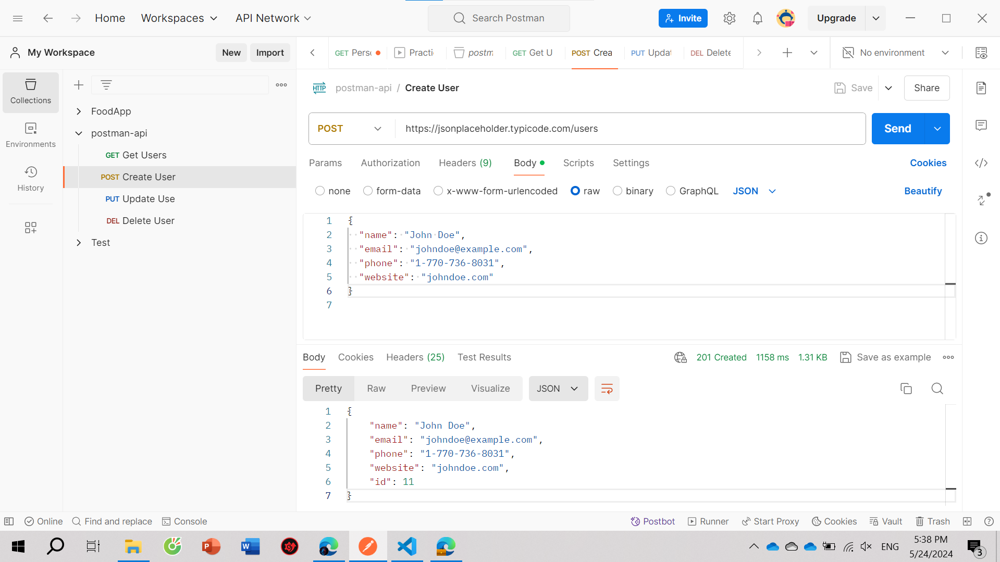
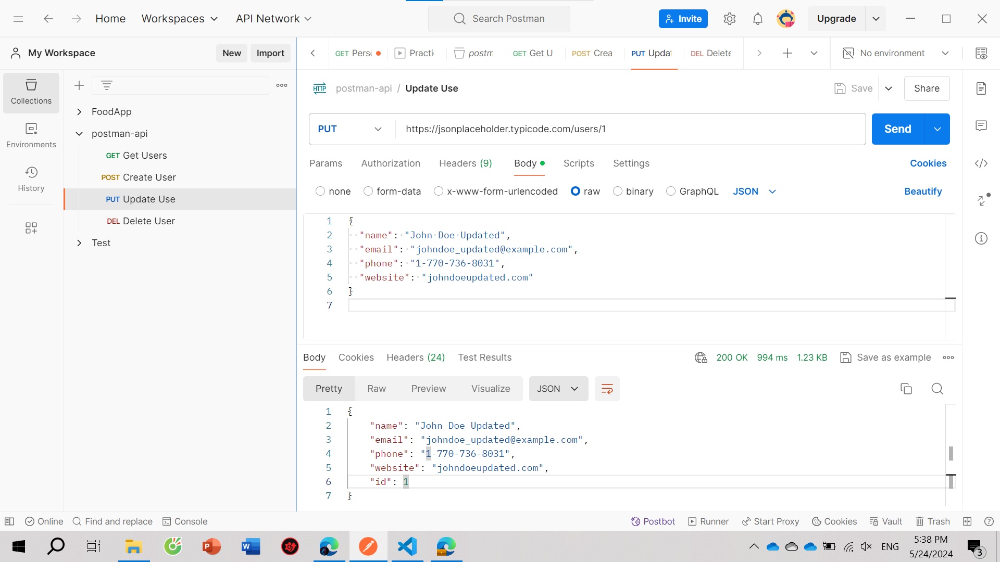
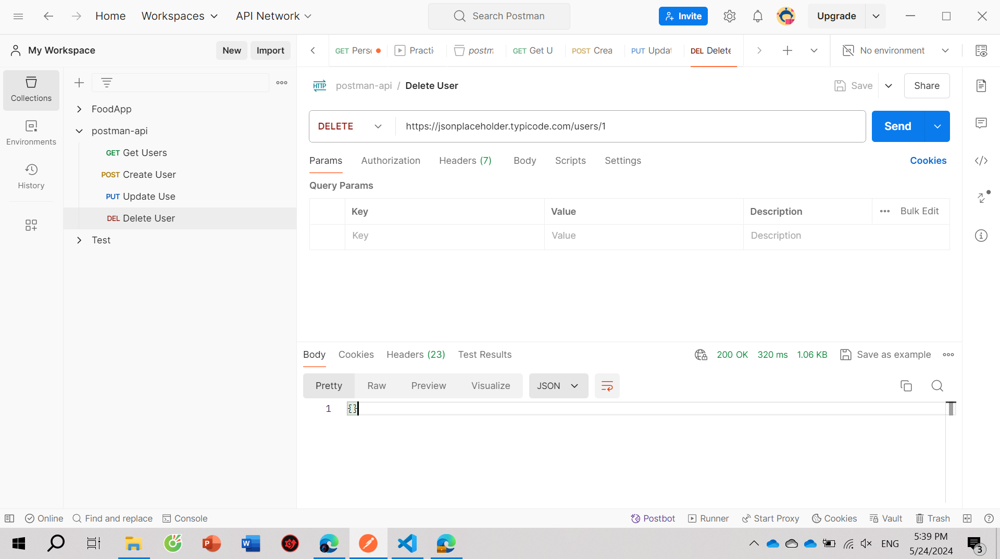

# Practice-Postman

## Mục tiêu:
- Nắm vững các khái niệm cơ bản về kiểm thử API.
- Rèn luyện kỹ năng sử dụng Postman để thực hiện các thao tác kiểm thử API.
- Áp dụng kiến thức đã học để thực hiện một bài tập thực tế.
### API Được Chọn
- jsonplaceholder.typicode.com
    + API cho phép tạo, xem, cập nhật và xóa người dùng.
## API Endpoints
1. **Create User (POST)**
   - **URL**: `https://jsonplaceholder.typicode.com/users`
   - **Method**: POST
   - **Request Body**:
     ```json
     {
       "name": "John Doe",
       "email": "johndoe@example.com",
       "phone": "1-770-736-8031",
       "website": "johndoe.com"
     }
     ```
   - **Expected Response Code**: `201 Created`
   -

2. **Get Users (GET)**
   - **URL**: `https://jsonplaceholder.typicode.com/users`
   - **Method**: GET
   - **Expected Response Code**: `200 OK`
   - 

3. **Update User (PUT)**
   - **URL**: `https://jsonplaceholder.typicode.com/users/1`
   - **Method**: PUT
   - **Request Body**:
     ```json
     {
       "name": "John Doe Updated",
       "email": "johndoe_updated@example.com",
       "phone": "1-770-736-8031",
       "website": "johndoeupdated.com"
     }
     ```
   - **Expected Response Code**: `200 OK`
   - 

4. **Delete User (DELETE)**
   - **URL**: `https://jsonplaceholder.typicode.com/users/1`
   - **Method**: DELETE
   - **Expected Response Code**: `200 OK`
   - 

## How to Use
1. Clone the repository:
   ```bash
   git clone https://github.com/Phamducvinh/-Practice-Postman
